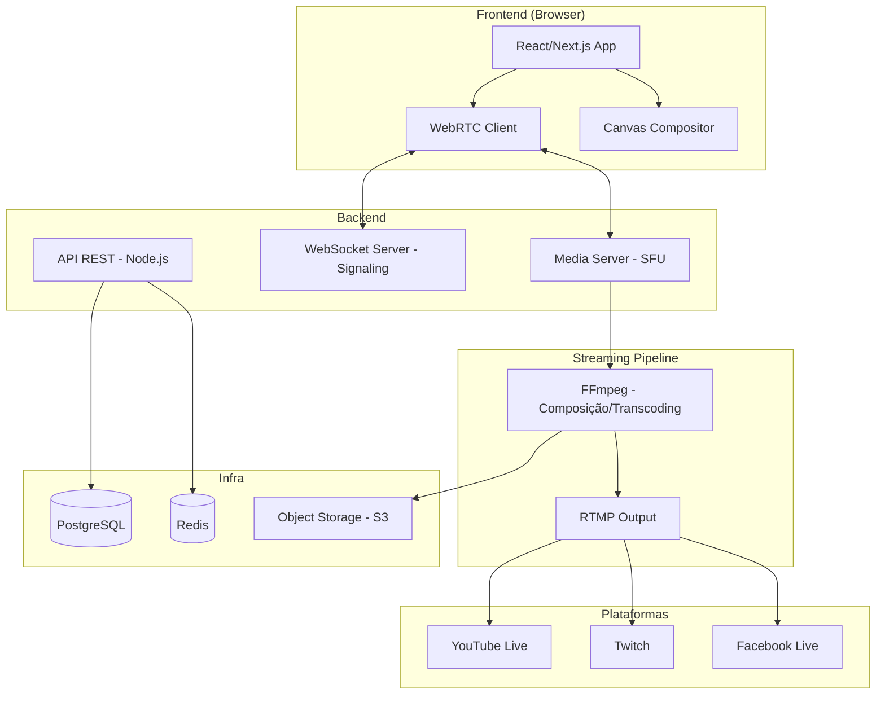
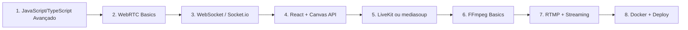

# 🎬 Roadmap: Clone do StreamYard

## O que é o StreamYard?

Um **estúdio de live streaming no navegador** que permite:
- Transmitir ao vivo para YouTube, Twitch, Facebook, LinkedIn, etc.
- Convidar participantes via link (sem instalar nada)
- Adicionar overlays, banners, logos e fundos
- Compartilhar tela
- Múltiplos layouts (solo, side-by-side, grid)
- Gravar sessões
- Chat integrado das plataformas

---

## 🧱 Arquitetura Geral



---

## 📚 Tecnologias para Aprender

### 1. WebRTC (⭐ Mais Importante)
| O quê | Por quê |
|-------|---------|
| **getUserMedia API** | Capturar câmera e microfone do navegador |
| **RTCPeerConnection** | Conexão P2P de áudio/vídeo entre participantes |
| **Signaling (WebSocket)** | Trocar ofertas SDP e candidatos ICE para estabelecer conexão |
| **STUN/TURN Servers** | Atravessar firewalls e NATs |

> [!TIP]
> Comece criando um **videochat simples 1:1** antes de qualquer coisa. Isso solidifica os conceitos de WebRTC.

**Recursos:**
- [WebRTC for the Curious](https://webrtcforthecurious.com/) (gratuito)
- [MDN WebRTC Guide](https://developer.mozilla.org/en-US/docs/Web/API/WebRTC_API)

---

### 2. Media Server (SFU)
Para mais de 2 participantes, P2P puro não escala. Você precisa de um **SFU (Selective Forwarding Unit)**.

| Opção | Linguagem | Observação |
|-------|-----------|------------|
| **[LiveKit](https://livekit.io/)** | Go | ⭐ Recomendado — open source, SDKs prontos, mais fácil de começar |
| **[mediasoup](https://mediasoup.org/)** | Node.js/C++ | Muito usado, mais controle, curva de aprendizado maior |
| **[Janus](https://janus.conf.meetecho.com/)** | C | Poderoso mas complexo |

> [!IMPORTANT]
> **LiveKit** é a escolha mais moderna e tem SDKs para React, Flutter, etc. Ideal para quem está começando. Ele já resolve STUN/TURN, rooms, e signaling.

---

### 3. Composição de Vídeo e Overlays

Duas abordagens possíveis:

| Abordagem | Como funciona | Prós | Contras |
|-----------|--------------|------|---------|
| **Canvas no Browser** | Usa `<canvas>` para desenhar streams + overlays | Mais simples, controle visual | Performance no cliente |
| **FFmpeg no Server** | Servidor compõe os streams com overlays via FFmpeg | Qualidade consistente | Mais complexo, mais infra |

> [!TIP]
> Para um MVP, comece com **composição no Canvas do browser**. Depois migre para server-side com FFmpeg.

---

### 4. Streaming para Plataformas (RTMP)
| Tecnologia | Uso |
|------------|-----|
| **RTMP** | Protocolo padrão para enviar stream para YouTube/Twitch/Facebook |
| **FFmpeg** | Transcodifica e envia o stream via RTMP |
| **node-media-server** | Servidor RTMP em Node.js (para receber e reencaminhar) |

O fluxo simplificado:
```
Canvas/MediaRecorder → WebSocket/HTTP → Servidor → FFmpeg → RTMP → YouTube/Twitch
```

---

### 5. Stack de Desenvolvimento

#### Frontend
| Tech | Uso |
|------|-----|
| **React** ou **Next.js** | Interface do estúdio |
| **TypeScript** | Tipagem para código mais seguro |
| **Canvas API** | Composição visual dos streams |
| **MediaRecorder API** | Gravar a sessão no browser |

#### Backend
| Tech | Uso |
|------|-----|
| **Node.js + Express/Fastify** | API REST |
| **WebSocket (Socket.io)** | Signaling, chat em tempo real, controle do estúdio |
| **FFmpeg** | Transcoding e push RTMP |
| **Bull/BullMQ** | Filas de jobs (processamento de vídeo) |

#### Banco de Dados & Cache
| Tech | Uso |
|------|-----|
| **PostgreSQL** | Dados de usuários, salas, gravações |
| **Redis** | Cache, sessões, pub/sub em tempo real |

#### Infra & Deploy
| Tech | Uso |
|------|-----|
| **Docker** | Containerização |
| **Nginx** | Reverse proxy, SSL |
| **S3 / MinIO** | Armazenamento de gravações |
| **Coturn** | Servidor TURN para WebRTC |

---

## 🗺️ Roadmap em Fases

### Fase 1 — Fundamentos (2-4 semanas)
- [ ] Aprender WebRTC: criar um videochat 1:1 no browser
- [ ] Entender Signaling com WebSocket
- [ ] Configurar STUN/TURN (pode usar servidores públicos no início)
- [ ] Criar interface básica com React

### Fase 2 — Sala com Múltiplos Participantes (3-4 semanas)
- [ ] Integrar LiveKit ou mediasoup como SFU
- [ ] Criar sistema de "salas" (rooms)
- [ ] Convite por link (guest join sem login)
- [ ] Exibir múltiplos vídeos na tela

### Fase 3 — Estúdio Visual (3-4 semanas)
- [ ] Implementar layouts (solo, side-by-side, grid)
- [ ] Composição com Canvas API
- [ ] Adicionar overlays: banners de texto, logos, fundos
- [ ] Compartilhamento de tela (getDisplayMedia)

### Fase 4 — Streaming para Plataformas (2-3 semanas)
- [ ] Configurar FFmpeg no servidor
- [ ] Receber stream do browser (MediaRecorder → WebSocket)
- [ ] Push RTMP para YouTube/Twitch
- [ ] Multistreaming (enviar para múltiplas plataformas simultaneamente)

### Fase 5 — Funcionalidades Extras (3-4 semanas)
- [ ] Gravação e armazenamento (S3/MinIO)
- [ ] Chat integrado (YouTube/Twitch chat API)
- [ ] Controles do host: mutar participantes, remover, etc.
- [ ] Autenticação e dashboard de gerenciamento

### Fase 6 — Produção e Polimento (2-4 semanas)
- [ ] Deploy com Docker + Docker Compose
- [ ] Configurar Nginx + SSL
- [ ] Otimização de performance e qualidade
- [ ] Testes de carga
- [ ] Monitoramento e logs

---

## ⏱️ Estimativa Total
**~15 a 23 semanas** (4-6 meses) trabalhando consistentemente, dependendo do seu nível atual.

---

## 🎯 Ordem de Estudo Sugerida



> [!NOTE]
> Você já tem experiência com **Laravel/PHP**. O backend desse projeto geralmente é feito em **Node.js** por causa do ecossistema WebRTC/media. Porém, a API de gerenciamento (usuários, salas, billing) pode ser feita em Laravel tranquilamente, usando Node.js apenas para a parte de mídia.

---

## 💡 Projetos Intermediários para Praticar

Antes de construir o clone completo, faça esses mini-projetos:

1. **Chat em tempo real** — WebSocket + React (1-2 dias)
2. **Videochat 1:1** — WebRTC puro + signaling server (3-5 dias)
3. **Videochat em grupo** — LiveKit + React (3-5 dias)
4. **Canvas compositor** — Desenhar vídeos + texto em Canvas (2-3 dias)
5. **Stream para YouTube** — FFmpeg + RTMP (2-3 dias)

---

## 🔗 Recursos Essenciais

| Recurso | Link |
|---------|------|
| WebRTC for the Curious | https://webrtcforthecurious.com/ |
| LiveKit Docs | https://docs.livekit.io/ |
| mediasoup Docs | https://mediasoup.org/documentation/ |
| FFmpeg Wiki | https://trac.ffmpeg.org/wiki |
| Canvas API (MDN) | https://developer.mozilla.org/en-US/docs/Web/API/Canvas_API |
| RTMP Specification | https://rtmp.veriskope.com/docs/spec/ |
| StreamYard (referência) | https://streamyard.com/ |
